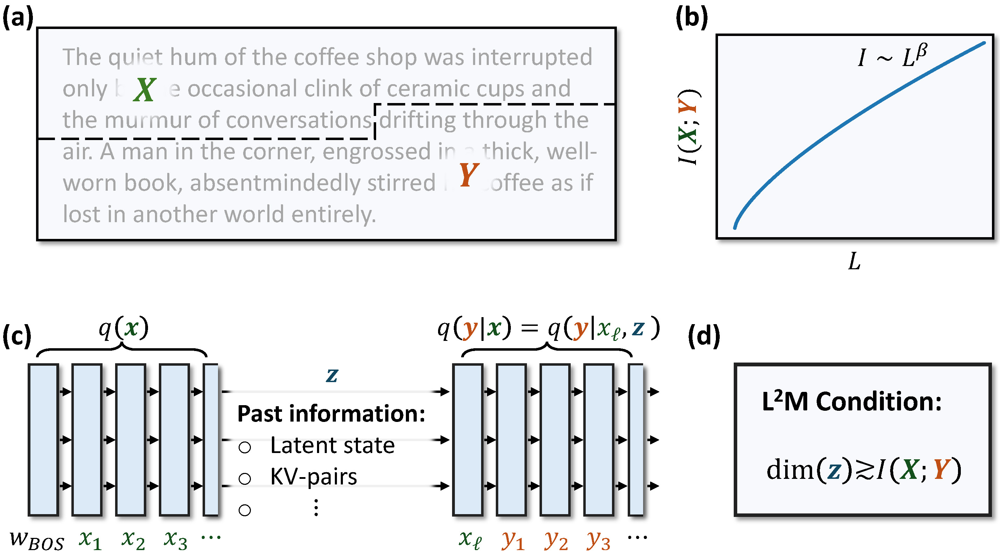
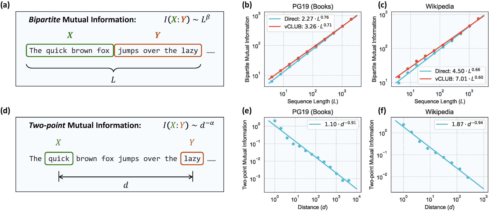

# (NeurIPS 2025) L²M: Mutual Information Scaling Law for Long-Context Language Modeling

Official code repository for the paper "[L²M: Mutual Information Scaling Law for Long-Context Language Modeling](https://neurips.cc/virtual/2025/loc/san-diego/poster/115721)".

## Overview

This repository contains code for reproducing the experiments and results from our paper, which establishes a bipartite mutual information scaling law in natural language that governs long-range dependencies. We formulate the Long-context Language Modeling (L²M) condition, which relates a model's capacity for effective long context length modeling to the scaling of its latent state size for storing past information.



*Figure 1: Illustration of the central ideas of our work.*



*Figure 2: Illustration and estimates of the scalings of both bipartite and two-point mutual information.*

## High Level Video Explanation of Our Work

[](https://www.youtube.com/watch?v=--q76wondYM)

## Repository Structure

The repository is organized as follows:

- `measure_mutual_info/`: Code for estimating bipartite mutual information using LLMs as well as the two-point mutual information
- `train_on_pg19/`: Code for experiments on the PG19 dataset

## Citation

```bibtex
@misc{chen2025l2mmutualinformationscaling,
      title={L$^2$M: Mutual Information Scaling Law for Long-Context Language Modeling}, 
      author={Zhuo Chen and Oriol Mayné i Comas and Zhuotao Jin and Di Luo and Marin Soljačić},
      year={2025},
      eprint={2503.04725},
      archivePrefix={arXiv},
      primaryClass={cs.CL},
      url={https://arxiv.org/abs/2503.04725}, 
}
